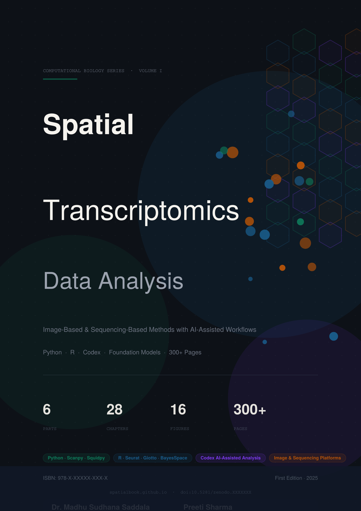

<div align="center">



# Spatial Transcriptomics Data Analysis

**Authors:** Dr. Madhu Sudhana Saddala & Preeti Sharma  
**Website:** [madhubioinformatics.github.io/spatialbook.github.io](https://madhubioinformatics.github.io/spatialbook.github.io/)

[](https://www.amazon.com)
[](./preview.pdf)
[](https://www.amazon.com)
[](https://www.amazon.com)

</div>

---

## About

A comprehensive 200-page textbook on spatial transcriptomics data analysis covering
Python, R, and AI workflows for Visium, Xenium, MERFISH, and CosMx platforms.

- **Python** — Scanpy, Squidpy, cell2location, scVI, LIANA
- **R** — Seurat v5, BayesSpace, Giotto, BANKSY, CellChat, NicheNet
- **AI** — Geneformer, scGPT, custom Copilot workflows
- **Platforms** — Visium, Visium HD, Xenium, CosMx, MERFISH, Slide-seq

---

## Contents

| Part | Topic |
|------|-------|
| I | Foundations — Technology, Data Formats, Environment |
| II | Sequencing-Based Platforms (Visium, Slide-seq) |
| III | Image-Based Platforms (Xenium, CosMx, MERFISH) |
| IV | Multi-Modal Integration & Batch Correction |
| V | AI & Foundation Models |
| VI | Case Studies — Brain, Tumour, Organoids |
| Appendices A–H | Packages, Datasets, Glossary, Troubleshooting |

---

## Free Preview

📄 **[Download Free 6-Page Preview](./preview.pdf)**  
Includes: Cover · Author bios · Full table of contents · Chapter 1 introduction

---

## Buy the Full Book

🛒 **[Kindle eBook — $9.99](https://www.amazon.com)**  
📖 **[Paperback — $24.99](https://www.amazon.com)**

> Amazon link updated once KDP listing is approved (24–72 hrs)

---

## Citation

```bibtex
@book{saddala2025spatial,
  title     = {Spatial Transcriptomics Data Analysis},
  author    = {Saddala, Madhu Sudhana and Sharma, Preeti},
  year      = {2025},
  publisher = {Amazon KDP},
  url       = {https://madhubioinformatics.github.io/spatialbook.github.io/}
}
```

---

## License

© 2025 Dr. Madhu Sudhana Saddala & Preeti Sharma. All rights reserved.  
Free 6-page preview available. Full book available for purchase on Amazon KDP.
